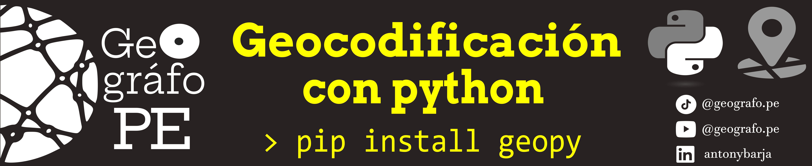

Este repositorio 🗂️ contiene un script📜 desarrollado en python que te permitirá  realizar el proceso de geocodificación directa o inverso a través de un cuaderno de jupyter.

*"📍 La geocodificación es un geoproceso que convierte direcciones o  información de ubicaciones en datos espaciales, permitiendo su visualización a través de puntos en un mapa 🗺️."*

Para este video usaremos las siguientes librerias:
- **geopy**: Librería que permite realizar el proceso de geocodificación a través de diferentes servicios.
- pandas: Librería que permite crear, manipular y guardar dataframes 
- geopandas: Librería que permite manipular datos espaciales de tipo vector
- mapclassify: Librería que permite clasificar de forma discreta a los datos espaciales para faciliar su visualización.

Todo el proceso desarrollado esta explicado paso a paso en el siguiente video de Youtube 🎥.

¡Enteráte más y aprender conmigo! 🔍💡 Suscríbete, activa las notificaciones 🔔 y únete a la comunidad que ama el software libre. 🌟🌍 👇
-  https://www.youtube.com/@geografope

-  https://www.tiktok.com/@geografope
## 🟡 Referencias: 
 - *https://support.esri.com/en-us/gis-dictionary/geocoding*
 - *https://github.com/osm-search/Nominatim*
